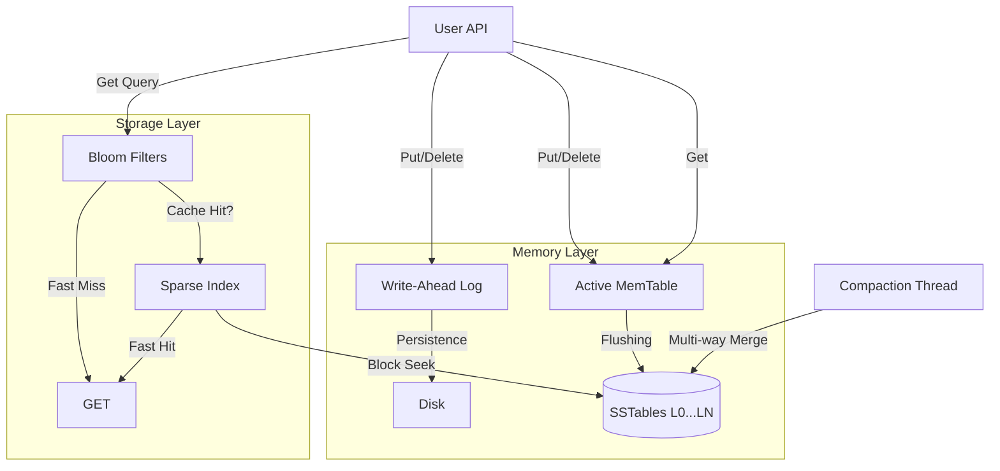

# LSM-Tree Storage Engine

[](https://opensource.org/licenses/MIT)
[](https://github.com/0Albiere/LSM-Tree_Storage_Engine_TEST/actions)

A high-performance Log-Structured Merge-Tree (LSM-Tree) storage engine implemented in Rust. Optimized for write-heavy workloads with background compaction and probabilistic read optimization.

**[DESIGN.md](file:///c:/Users/Albiere/Desktop/LSM-Tree%20Storage%20Engine/DESIGN.md)** | **[Benchmarks](file:///c:/Users/Albiere/Desktop/LSM-Tree%20Storage%20Engine/walkthrough.md#performance-report)** | **[Technical Takeaways](file:///c:/Users/Albiere/Desktop/LSM-Tree%20Storage%20Engine/EXECUTIVE_SUMMARY.md)**

---

### ⚡ Highlights
- **High-Performance Writes**: Sustained 20k+ ops/sec throughput with sub-millisecond P99 latency.
- **Strict Reliability**: Full crash recovery via WAL and CRC32 SSTable checksums.
- **Zero-Dependency**: Compiled with 100% pure Rust Standard Library for maximum portability.

---

## 🚀 Features

- **High-Performance Writes**: Log-structured design with Write-Ahead Log (WAL) and in-memory MemTable.
- **Persistence**: Efficient flushing of MemTables into immutable SSTables (Sorted String Tables).
- **Background Compaction**: Automatic merging of SSTables using a k-way merge algorithm to optimize space and read performance.
- **Read Optimization**: 
    - **Bloom Filters**: Fast membership checks to skip unnecessary disk I/O.
    - **Sparse Index**: Multi-level indexing for logarithmic search time in SSTables.
- **Reliability**: Crash recovery via WAL playback on engine startup.
- **Strict Correctness**: Property-based testing via `proptest` and high-concurrency safety using `parking_lot`.

## 🏗️ Architecture



## 📦 Installation

Add this to your `Cargo.toml`:

```toml
[dependencies]
lsm_storage_engine = { git = "https://github.com/0Albiere/LSM-Tree_Storage_Engine_TEST.git" }
```

Alternatively, to build from source:
```bash
git clone https://github.com/0Albiere/LSM-Tree_Storage_Engine_TEST.git
cd LSM-Tree_Storage_Engine_TEST
cargo build --release
```

## 🛠️ Usage

```rust
use lsm_storage_engine::Engine;

fn main() -> std::io::Result<()> {
    // Open the engine (directory, max_memtable_size)
    let engine = Engine::open("./data", 4 * 1024 * 1024)?; // 4MiB threshold
    
    // Insert/Update
    engine.put(b"user:123".to_vec(), b"Albiere".to_vec())?;
    
    // Retrieve
    if let Some(val) = engine.get(b"user:123")? {
        println!("User: {:?}", String::from_utf8(val).unwrap());
    }
    
    // Delete (inserts a tombstone)
    engine.delete(b"user:123".to_vec())?;
    
    Ok(())
}
```

### 🏃 Minimal Runnable Example
You can run the included example directly:
```bash
cargo run --example basic_usage
```

## 🧪 Testing & Benchmarks

Run the full test suite (including property-based tests):
```bash
cargo test
```

Run performance benchmarks:
```bash
cargo bench
```

## 📜 License

Distributed under the MIT License. See `LICENSE` for more information.
